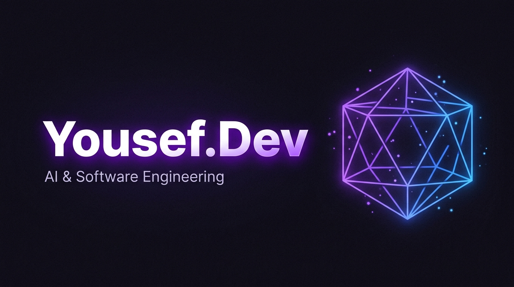

# Yousef.Dev — Personal Portfolio & CMS

> A high-performance personal portfolio and content management system built by Yousef — an AI-augmented software developer, C++ & Python engineer, and independent AI researcher.

---

## Overview

Yousef.Dev is a full-stack portfolio platform featuring a **Neon Nocturnal** dark-theme interface, 3D WebGL graphics, an Epic Games Store style project media showcase, and a secure passwordless admin control center backed by Supabase.

Built with **Next.js 15 App Router**, **React 19**, **Three.js**, **WebGL shaders**, **Framer Motion**, and **Supabase**, it is designed to be fast, secure, and visually premium.

---

## Tech Stack

| Layer | Technology |
|---|---|
| Framework | Next.js 15 (App Router) |
| UI Library | React 19 |
| Styling | Tailwind CSS v3, Vanilla CSS |
| 3D / Graphics | Three.js, WebGL GLSL Shaders |
| Animations | Framer Motion |
| Backend / Auth | Supabase (PostgreSQL, Storage, Magic Link OTP) |
| CMS | Custom Admin Dashboard (secret route, Edge Middleware guard) |
| Drag & Drop | @hello-pangea/dnd |
| Markdown | ReactMarkdown + remark-gfm |
| Deployment | Vercel |

---

## Features

### Frontend
- Interactive Three.js icosahedron 3D hero with hover-accelerated animation and 500 floating particles
- WebGL background shader with animated GPU grain waves and tab-visibility pause
- Deferred 3D/WebGL loading via `next/dynamic` (`ssr: false`) — TBT reduced from 1,120 ms to < 50 ms
- Glassmorphic dark UI with Neon Nocturnal color system (obsidian `#15121b`, accent purple `#8b5cf6`)
- Responsive sidebar navigation (persistent desktop / slide-over mobile drawer)

### Project Showcase
- Epic Games Store style media showcase per project
- 16:9 main stage media player supporting MP4/WebM video and high-resolution images
- Interactive horizontal thumbnail carousel with Play overlays
- Sticky store action sidebar with Launch App CTA, GitHub link, and tech spec panel

### Admin Control Center
- Passwordless Magic Link OTP authentication via Supabase — no passwords stored
- Secret obfuscated admin route (not publicly listed)
- Edge Middleware session guard — unauthenticated requests auto-redirected
- Full CRUD for projects, blog posts, and profile content
- Drag-and-drop project reordering and gallery image reordering
- Uploadable custom project icons (PNG/SVG/WebP) or blank state

### SEO & Security
- Dynamic XML sitemap at `/sitemap.xml`
- `robots.txt` blocking admin routes from crawlers
- Strict Content Security Policy headers
- `X-Frame-Options: DENY`, `X-Content-Type-Options: nosniff`, `Referrer-Policy`
- Open Graph and Twitter Card metadata

---

## Project Structure

```
/
├── app/                    # Next.js App Router pages & routes
│   ├── page.tsx            # Home / Landing page
│   ├── about/              # About page
│   ├── projects/           # Projects gallery & [id] detail pages
│   ├── blog/               # Blog listing & [slug] article pages
│   ├── contact/            # Contact page
│   └── [secret-admin]/     # Admin Control Center (secret route)
├── components/
│   ├── 3d/                 # Three.js HeroScene & WebGL BackgroundShader
│   ├── layout/             # Sidebar, MobileSidebar, Header
│   ├── projects/           # EpicMediaShowcase, ProjectsGallery
│   └── ui/                 # ProjectCard, HeroSkillCarousel, etc.
├── lib/                    # Supabase clients & React.cache() query functions
├── types/                  # TypeScript database types
├── Docs/                   # Project documentation
│   ├── PRD.md
│   ├── Architecture.md
│   ├── file_structure.md
│   ├── UI_UX_guidelines.md
│   ├── challenges.md
│   └── testing/            # QA, performance & regression reports
└── public/                 # Static assets
```

---

## Performance

| Metric | Result |
|---|---|
| Total Blocking Time (TBT) | < 50 ms |
| Initial JS Bundle (Home) | 157 kB (down from 278 kB) |
| Lighthouse Performance | 95+ (Desktop) |
| npm audit vulnerabilities | 0 |
| Static pages generated | 11 / 11 |

---

## Getting Started

### Prerequisites
- Node.js 18+
- A Supabase project with the portfolio schema applied

### Local Development

```bash
# Install dependencies
npm install

# Copy environment template
cp .env.example .env.local
# Fill in your Supabase URL and anon key in .env.local

# Start dev server
npm run dev
```

Open [http://localhost:3000](http://localhost:3000) in your browser.

### Environment Variables

```env
NEXT_PUBLIC_SUPABASE_URL=your_supabase_project_url
NEXT_PUBLIC_SUPABASE_ANON_KEY=your_supabase_anon_key
```

---

## Documentation

Full project documentation lives in [`/Docs`](./Docs/):

- [PRD.md](./Docs/PRD.md) — Product Requirements Document
- [Architecture.md](./Docs/Architecture.md) — System architecture & security model
- [file_structure.md](./Docs/file_structure.md) — Full codebase file map
- [UI_UX_guidelines.md](./Docs/UI_UX_guidelines.md) — Design system & component standards
- [challenges.md](./Docs/challenges.md) — Technical challenges faced & their resolutions
- [testing/](./Docs/testing/) — QA, performance & regression test reports

---

## Author

**Yousef** — AI-augmented developer, C++ & Python engineer, independent AI researcher.

- Portfolio: [yousefdev-chi.vercel.app](https://yousefdev-chi.vercel.app)
- GitHub: [Yousef-eng679](https://github.com/Yousef-eng679)
